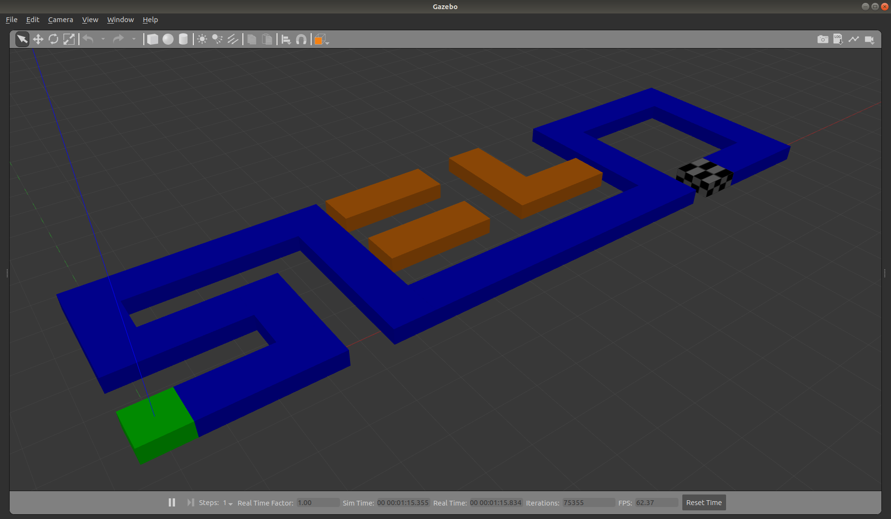

Seyo Robotics Engineer Assignment
====================================================================

## Objective

You will build a simulated ground-based robot in [Gazebo](http://gazebosim.org/) that can be moved around on a flat surface by sending it high-level instructions. You are provided with a Gazebo world file ([<seyo.world>](seyo.world)) describing a simulation environment that looks as follows:

The goal of your robot is to be able to move along the blue section of the raised platform, starting at the green block at coordinate `(0,0)` and ending at the chequered block, without falling off the edge of the platform.

## Deliverables

Your simulation package must:

1. include a model of a robot that can move both linearly and rotationally;
1. include a control node, coded in C++, that can receive high-level movement instructions and send the necessary commands to the simulated robot to achieve the desired motion. At least three types of movement instructions must be able to be executed:
    1. Move forward by a specified distance
    1. Turn right (rotate the robot 90 degrees clockwise)
    1. Turn left (rotate the robot 90 degrees counterclockwise)
1. be compatible with ROS Melodic and Gazebo 9.0;
1. be able to be fully started (i.e. both the simulated environment and the controller) with a single command, and your robot must be initially located at the green starting location on the provided platform.

Send us:

1. The full source code of the robot simulation and controller, including any code written which is not part of the normal program run (e.g. scripts).
1. Clear instructions on how to obtain, build, and run the simulation, as well as how to send the robot the necessary instructions to accomplish the goal.
1. A short report including:
    1. A brief description of the design of your simulated robotic system
    1. Explanations of all the assumptions you made
    1. A brief description of the design of the controller and why it was designed that way
    1. Any points you wish to include that convey your reasoning for design or implementation decisions
    1. A list of open-source source libraries or plugins you have made use of, if any, that don’t directly address the problem statement

Please provide any deliverable and instructions using a public GitHub (or similar) Repository, as several people will need to inspect the solution.

## Evaluation

The purpose of the exercise is for us to determine:

- Your ability to create software that transforms a robot from a machine into an autonomous system
- How you structure your software package
- How you use logic and reasoning to create a solution to an open-ended problem
- How you communicate your solution approach
- How you deal with uncertainty and extract specifications from high-level problem statements
- Your ability to learn autonomously

Specific coonsideration will be given to:

- Code organisation
- Code readability and style
- Quality of instructions
- Quality of report
- Performance of the simulated robot with respect to the goal

## :bulb: Tips

- The platform height is 0.4m above the ground plane.
- The lengths of the different platform sections can be determined using the gridlines on the ground, which are 1m apart by default. The grid can also be resized and repositioned in the Gazebo GUI, if necessary.
